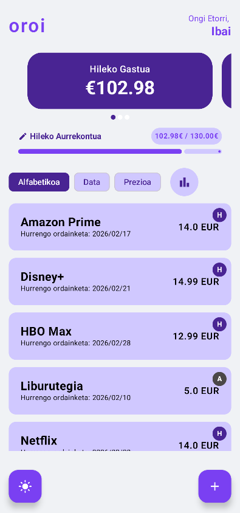
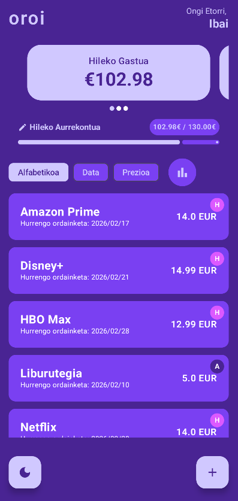
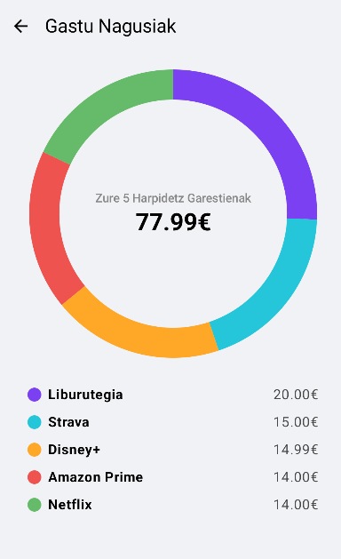
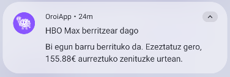
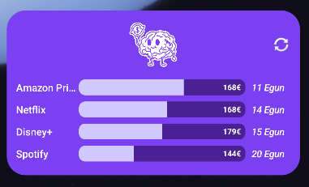

# OroiApp

### Zure harpidetzen kontrola, sinpletasunez.

`Oroi` euskerazko hitza da eta "gogoratu" esan nahi du. Aplikazio honen filosofia finantza-kontzientzia sustatzea da, tresna minimalist, dotore eta funtzional baten bidez. Erabiltzaileak bere harpidetzak eskuz sartzen ditu, gastuen jarraipen aktibo eta kontzientea bultzatuz.

Eskola-proiektu gisa garatua, Android-en teknologia modernoenak erabiliz, arkitektura garbi eta sendo bat jarraituz.

**Oharra:** Proiektu hau osorik euskaraz garatu da.

## 📱 Pantaila-argazkiak

### 🎨 Identitatea
<div align="center">
  
</div>

### 🌗 Interfaze Nagusia (Light & Dark)
Modu argia eta iluna guztiz integratuta daude diseinuarekin.

| Pantaila Nagusia (Light Mode) | Pantaila Nagusia (Dark Mode) |
| :---: | :---: |
|  |  |

### 📊 Estatistikak
Gastuak bisualki aztertzeko grafiko interaktiboa.



### 🔔 Jakinarazpen Adimendunak
Aurrezki potentziala gogorarazten duten abisuak.



### 🧩 Hasierako Pantailako Widget-a
Informazio azkarra aplikazioa ireki gabe.



## ✨ Ezaugarriak

### 🌟 Funtzionalitate Nagusiak

*   **Harpidetzen Kudeaketa Osoa:** Sortu, irakurri, eguneratu eta ezabatu (CRUD) zure hileko edo urteko harpidetzak modu sinplean.
*   **Diseinu Modernoa (Material 3):** Interfaze garbia, modu argi eta ilunarekin (Dark Mode) guztiz bateragarria, eta gaia eskuz aldatzeko aukerarekin.
*   **Kostuen Ikuspegia:** Karrusel interaktibo bat hileko, urteko eta eguneko gastu totalak ikusteko.
*   **Hileko Aurrekontua:** Ezarri gastu-muga bat eta ikusi bisualki (barra batekin) zenbat gastatu duzun eta muga gainditu duzun ala ez.
*   **Estatistikak (Pie Chart):** "Gazta-grafiko" interaktibo eta animatu bat (`Canvas` erabiliz egina), zure gastu nagusiak bisualki aztertzeko.
*   **Hasierako Pantailako Widget-a:** Ikusi hurrengo ordainketak eta falta diren egunak aplikazioa ireki gabe.
*   **Segurtasun Biometrikoa:** Babestu zure datuak hatz-marka edo aurpegi bidezko identifikazioarekin aplikazioa irekitzean.

### 🔔 Jakinarazpenak eta Automatizazioa

*   **Abisu Adimendunak:** `WorkManager` erabiliz, aplikazioak jakinarazpen bat bidaltzen du harpidetza bat berritu baino 2 egun lehenago, aurreztu dezakezun diru kopurua gogoraraziz.
*   **"Botoi Gorria":** Zerrendan ezkerrera irristatuz, zuzenean zerbitzuaren ezeztapen-orrira joateko esteka irekitzen da (Netflix, Spotify, etab.).

## 🛠️ Teknologiak eta Arkitektura

Proiektu hau Android garapeneko praktika onenak eta tresna modernoenak jarraituz eraiki da.

*   **Lengoaia:** %100 **Kotlin**.
*   **Interfazea:** %100 **Jetpack Compose**, UI deklaratibo eta erreaktibo bat sortzeko. Ez da Fragment-ik erabili ("Single-Activity Architecture").
*   **Arkitektura:** **MVVM** (Model-View-ViewModel), ardurak argi bereizteko.
*   **Datu-basea:** **Room**, datuen persistentzia lokala modu sendoan kudeatzeko.
*   **Asinkronia:** **Kotlin Coroutines** eta **Flow**, datu-fluxuak eta atzeko planoko eragiketak kudeatzeko.
*   **Nabigazioa:** **Jetpack Navigation**, aplikazioaren pantailen artean mugitzeko.
*   **Atzeko Planoko Lanak:** **WorkManager**, abisuak fidagarritasunez programatzeko.
*   **Widget-ak:** **Jetpack Glance**, hasierako pantailako widget-ak Compose estiloan sortzeko.
*   **Datuen Biltegiratzea:** **SharedPreferences** erabiltzailearen ezarpenak (izena, gaia, aurrekontua) gordetzeko.
*   **Segurtasuna:** **BiometricPrompt** autentifikaziorako.

### Proiektuaren Egitura

```
com.example.oroiapp
├── data/           # Room (DAO, Database) eta SharedPreferences biltegiak.
├── model/          # Datu-klaseak (Subscription, CancellationLink, etab.).
├── ui/             # Erabiltzailearen interfazea (Pantailak, Osagaiak, Gaia).
├── viewmodel/      # ViewModel klaseak eta Factory-a.
├── widget/         # Glance Widget-aren inplementazioa.
└── worker/         # WorkManager-eko langileak (ReminderWorker).
```

## ⚙️ Nola Exekutatu

1.  Repositorio hau klonatu:
    ```bash
    git clone https://github.com/igarridosi/AndroidProjects.git
    ```
2.  Ireki `OroiApp` karpeta Android Studio-rekin (Gomendatua: Iguana bertsioa edo berriagoa).
3.  Proiektua sinkronizatu (Gradle Sync).
4.  Exekutatu emuladore edo gailu fisiko batean (Android 8.0+ gomendatua).

## ✒️ Egilea

**Ibai Garrido** - [GitHub Profila](ZURE_GITHUB_PROFILAREN_HELBIDEA)
```