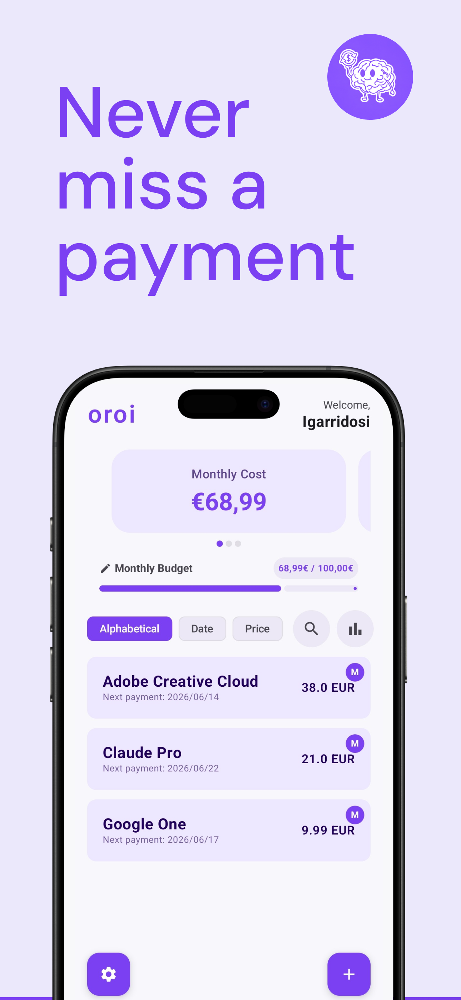
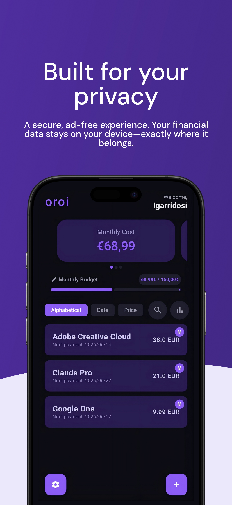
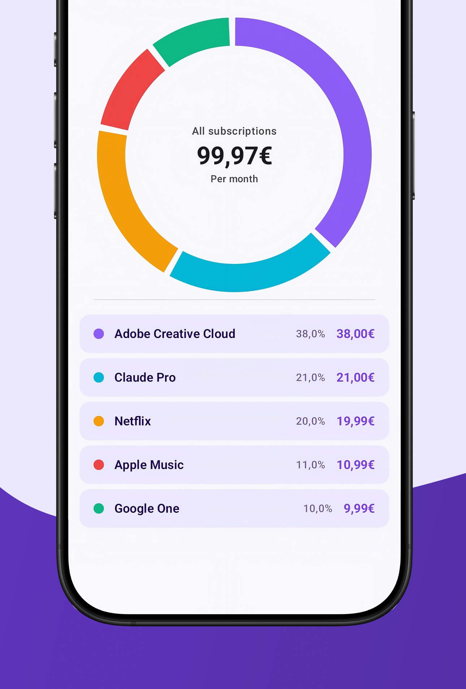
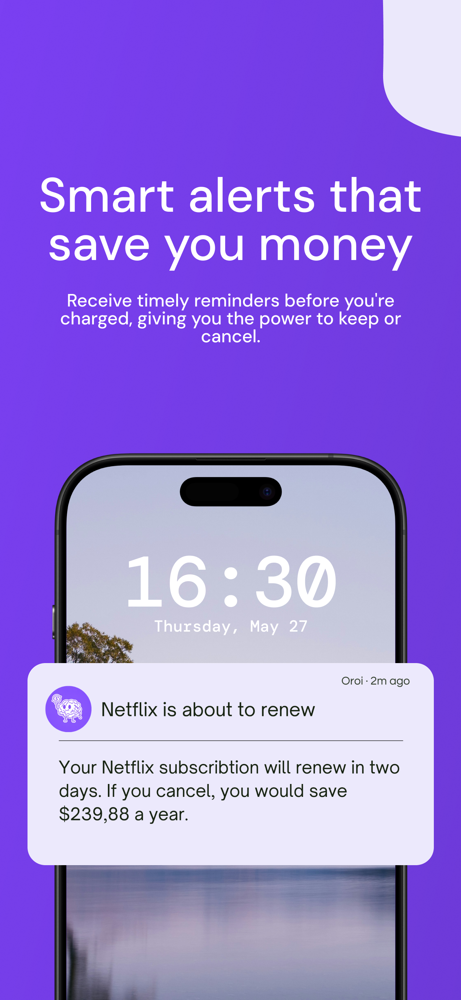
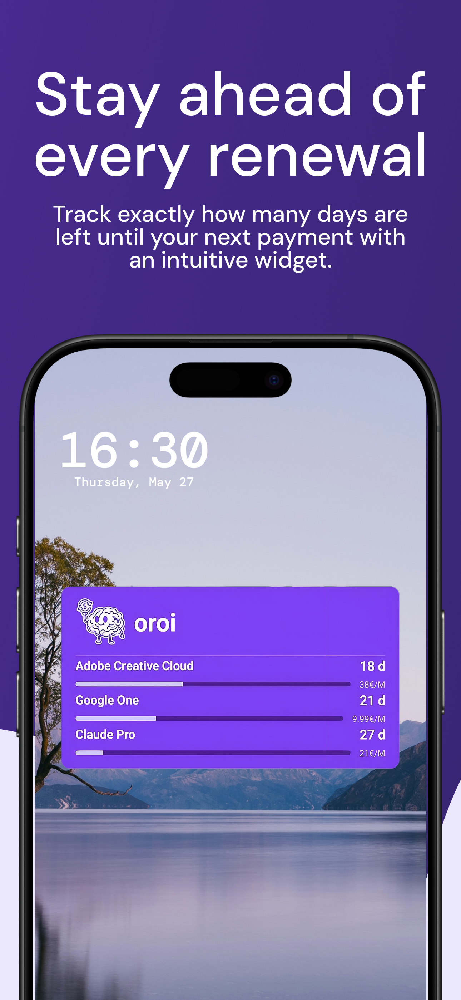

# OroiApp

### Take control of your subscriptions — simply.

**Oroi** comes from the Basque word *oroitu* (to remember). Its philosophy is to promote financial awareness through a minimal, elegant, and functional tool. Users add their subscriptions manually, encouraging active and conscious expense tracking.

Built as a school project using the latest Android technologies with a clean and solid architecture. Available in **English**, **Spanish**, and **Basque**.

## 📱 Screenshots

### 🎨 Identity
<div align="center">
  
</div>

### 🌗 Main Interface (Light & Dark)
Light and dark modes are fully integrated into the design.

| Main Screen (Light Mode) | Main Screen (Dark Mode) |
| :---: | :---: |
|  |  |

### 📊 Statistics
Interactive chart to visually analyse your spending.



### 🔔 Smart Notifications
Reminders that alert you before a renewal charges your account.



### 🧩 Home Screen Widget
Quick glance at upcoming renewals without opening the app.



## ✨ Features

### 🌟 Core Functionality

- **Full Subscription Management:** Create, read, update, and delete (CRUD) your monthly or annual subscriptions with ease.
- **Modern Design (Material 3):** Clean interface with full light and dark mode support, including a redesigned dark theme with a deep near-black foundation (`#0C0C14`) and a purple accent system — all using correct Material 3 color semantics.
- **Cost Carousel:** Interactive carousel showing your total monthly, annual, and daily spend at a glance.
- **Monthly Budget:** Set a spending limit and track it visually with a live progress bar.
- **Statistics (Donut Chart):** Fully custom animated donut chart built with `Canvas` — shows **all** your subscriptions with flat segment cuts, subtle colour dimming on selection, and a scrollable legend.
- **Purple-tinted Cards:** Subscription items and cost cards use a subtle purple tint that reflects the app's colour palette, making them stand out against the background in both light and dark mode.
- **Home Screen Widget:** See upcoming payments and days remaining without opening the app.

### 🔔 Notifications & Automation

- **Smart Reminders:** Using `WorkManager`, the app sends a notification 2 days before any subscription renews, reminding you of the charge amount.
- **Cancel Button:** Swipe left on any subscription to open a direct cancellation link for popular services (Netflix, Spotify, and more).

### 🌍 Internationalisation

- Full string localisation in **English**, **Spanish (es)**, and **Basque (eu)**.
- Per-app language switching via `AppCompatDelegate` — change language inside the app without restarting.

### 📤 Export & Privacy

- **CSV Export:** Export your full subscription list as a `.csv` file and share it via the standard Android share sheet.
- **100% Offline:** No internet permission, no account, no analytics. All data lives exclusively on your device (Room database + SharedPreferences).
- **Privacy Policy:** [oroi-privacy.netlify.app/privacy-policy.html](https://oroi-privacy.netlify.app/privacy-policy.html)

## 🛠️ Tech Stack & Architecture

| Layer | Technology |
|-------|-----------|
| Language | 100% **Kotlin** |
| UI | 100% **Jetpack Compose** — declarative, reactive, single-Activity |
| Architecture | **MVVM** (Model-View-ViewModel) |
| Database | **Room** — local persistence with KSP code generation |
| Async | **Kotlin Coroutines** + **Flow** |
| Navigation | **Jetpack Navigation Compose** |
| Background work | **WorkManager** — reliable reminder scheduling |
| Widget | **Jetpack Glance** — Compose-style home screen widgets |
| Charts | Custom **Canvas** donut chart |
| Settings | **SharedPreferences** (theme, language, monthly budget) |
| Build | Gradle Kotlin DSL, signed release with PKCS12 keystore |

### Project Structure

```
com.example.oroiapp
├── data/           # Room (DAO, Database) and SharedPreferences repositories
├── model/          # Data classes (Subscription, CancellationLink, etc.)
├── ui/             # UI screens, components, and theme (Color, Theme, Type)
├── viewmodel/      # ViewModel classes and Factory
├── widget/         # Glance Widget implementation
└── worker/         # WorkManager workers (ReminderWorker)
```

## ⚙️ How to Run

1. Clone this repository:
   ```bash
   git clone https://github.com/igarridosi/OroiApp.git
   ```
2. Open the project in **Android Studio** (Iguana or newer recommended).
3. Sync Gradle.
4. Run on an emulator or physical device (Android 7.0 / API 24+).

> **Note:** The release signing keystore (`oroi-release.jks`) and `keystore.properties` are intentionally excluded from the repo. The debug build runs without them.

## 📦 Latest Release

| Property | Value |
|----------|-------|
| Version | 1.0.0 |
| Package | `com.igarridosi.oroi` |
| Min Android | 7.0 (API 24) |
| Target Android | 15 (API 36) |

Download the latest APK from the [Releases page](https://github.com/igarridosi/OroiApp/releases/tag/v1.0.0).

## ✒️ Author

**Ibai Garrido** — [GitHub Profile](https://github.com/igarridosi)
